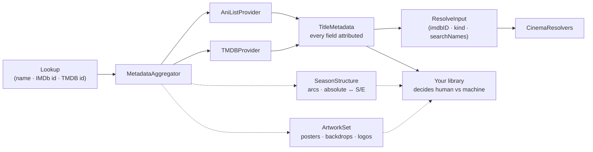

<div align="center">

# 🎞️ Slate

**What is this?**
A dependency-free Swift package that asks every metadata provider at once and answers with values that each say **where they came from**.

[](CHANGELOG.md)
[](https://swift.org)
[](#-platform-support)
[](https://swift.org/package-manager)
[](#-installation)
[](#-design-notes)
[](#-credentials)

</div>

---



## 🎬 The trio

Slate is one third of a set. The name is the clapperboard — the one object whose
whole job is to state what a piece of footage *is* before anyone can tell by
looking. A studio's *slate* is also its roster of titles.

| Package | Question it answers |
| :--- | :--- |
| **Slate** | *What is this?* |
| **CinemaResolvers** | *Where do I get it?* |
| **Cinema** | *Where do I watch it?* |

## ⚡ Quick start

```swift
let slate = MetadataAggregator(providers: [
    AniListProvider(),                     // no credential
    TMDBProvider(accessToken: token),      // injected, never stored
])

let result = await slate.metadata(for: Lookup(search: "Attack on Titan"))

result.title.best                  // "Shingeki no Kyojin"
result.title.bestProvider          // .aniList
result.overview.value(from: .tmdb) // TMDB's summary — still there
result.searchNames                 // romaji first, for the tracker
result.resolveInput                // hand straight to a resolver
```

## 🧭 The one rule: values carry their source

Every field of `TitleMetadata` is a `Field`, not a bare `String`:

| You ask | You get |
| :--- | :--- |
| `field.best` | The winning value |
| `field.bestProvider` | Who won it |
| `field.value(from:)` | What one specific provider said |
| `field.dissent` | What the losers said — reachable, never the default |
| `result.provenance` | `[FieldKey: Provider]` — the whole record at once |

This exists because of a specific bug. A library that stores merged values behind
a single *this record was edited* flag will, on a refresh from provider #4,
silently overwrite a correction to a field that provider #1 supplied — and it
reads as a sync bug for weeks. Provenance has to be **per field**, and it is far
cheaper to design in than to retrofit.

## ⚖️ Which decisions live where

> **Slate settles provider vs provider.**
> That AniList outranks TMDB for anime is a fact about AniList and TMDB, so no
> consumer should have to know it. That verdict is `field.best`.

> **Slate does not settle human vs machine.**
> Whether a hand-edit outranks a refresh is a fact about *your* schema and *your*
> user. `FieldKey` makes that policy a loop instead of a branch per field:

```swift
for (field, provider) in result.provenance {
    // "Did a human touch this field, and if not, is `provider` one I accept?"
    // Some fields stay machine-owned even on a hand-edited record — artwork,
    // ids, trailers — and that set is yours to declare, not Slate's.
}
```

Thirteen hand-written branches drift apart. A loop does not.

## 🔌 Providers

| Provider | Credential | Gives |
| :--- | :--- | :--- |
| **TMDB** | v4 read token | The IMDb id · western movies & TV · seasons · art · cast · trailer |
| **AniList** | **none** | Anime detection · romaji & native names · episode counts · voice actors · studio · tags · **relations** |
| **MDBList** | api key, optional | IMDb · Metacritic · both tomatometers · Letterboxd · Trakt · MyAnimeList |
| **Fribb bridge** | **none** | Broadcast ids → AniList · MyAnimeList · AniDB ids |

**Two deliberate silences.** TMDB reports `isAnime` as `nil`, never `false` — it
has no anime type and its `anime` keyword is volunteer-applied, so AniList
answering *at all* is the signal; a guess dressed as a value is worse than an
absence. And AniList synonyms are filtered to mostly-Latin names: romaji, English
and native Japanese are always kept because trackers do file under the Japanese
title, but AniList carries the Thai, Hebrew and Arabic name of everything, and a
resolver that matches by substring gets nothing from those but false hits.

A provider that fails is **not** an error. It lands in `result.failures` and the
others still answer.

## 📺 Seasons and episodes

TV shows have seasons and episodes, and a provider that says *366 episodes, one
season* has not answered the question. TMDB files Bleach that way; Detective
Conan as one season of 1212. Nothing else in the world numbers them like that —
Wikipedia, TheTVDB and the groups that name the releases all count arcs.

```swift
let structure = await slate.seasons(for: result.ids)

structure?.ordering                       // .episodeGroup(name: "TVDB Order")
structure?.numberedSeasons.count          // 16, not 1
structure?.position(ofAbsolute: 340)      // "Bleach - 340" → S14E7
structure?.nativeRange(ofSeason: 2)       // (season: 1, episodes: 21...41)
```

The correction comes from TMDB itself, through `episode_groups` — which means
**TheTVDB's ordering without a TheTVDB key.**

It intervenes narrowly, and that is the whole safety argument. Only when TMDB is
clearly flattening (any season of 60+), only towards an ordering that accounts
for *every* episode the show is said to have, and only by name — `TVDB Order`
first, then an original-air-date ordering. Story-arc orderings are never a
fallback: Bleach carries three that split the same 366 episodes 21, 12 and 25
ways, and picking one arbitrarily silently renumbers somebody's library.

| Question | Answer |
| :--- | :--- |
| `position(ofAbsolute:)` | `Bleach - 340` → the season and episode it is shown under |
| `absolute(ofSeason:episode:)` | back the other way |
| `nativeRange(ofSeason:)` | the provider's own numbers for an arc — what an indexer can be asked |
| `position(ofNativeSeason:episode:)` | filing a file that was matched against TMDB |
| `absoluteNumbering` | `.stated` when the provider states the correspondence, `.derived` when it was walked |

Past the end of a run is left **unmapped, never clamped**. A number beyond the
last episode means the season list is incomplete or the show was matched wrongly,
and filing it somewhere plausible hides that instead of showing it.

### Checked against the live API

| Corrected | Left alone |
| :--- | :--- |
| Bleach — 366 flat → 17 arcs | Attack on Titan · Demon Slayer |
| Detective Conan — 1212 → 31 years | SPY×FAMILY · Frieren · Chainsaw Man |
| Jujutsu Kaisen — 59 → `24,23,12` | Hunter × Hunter (2011) — its 62/74/12 stands |
| Dragon Ball — 153 → 6 Toei divisions | Suits · Breaking Bad |
| One Piece · Naruto Shippūden — `TVDB Order` | |

Getting the *show* right matters as much as the seasons: "Dragon Ball" used to
resolve to Dragon Ball Z, and "Hunter x Hunter" to the 1999 adaptation rather
than the 2011 one — 62 episodes instead of 148, and every absolute number mapped
against the wrong run. Among results carrying the asked-for title exactly, the
popular one wins.

> Season logic ported from Cinema's `ShowSeasons`, `ArcSeasons` and
> `AbsoluteEpisodeMap`, whose thresholds were arrived at against real shows.

## 🖼 Artwork

One poster URL is not an answer either. A show has forty of them, in a dozen
languages, and which one is right depends on who is looking.

```swift
let art = await slate.artwork(for: result.ids, kind: .series)

art.best(.poster, preferring: ["fr", "en"])   // a poster they can read
art.best(.backdrop)                            // textless, for behind a title
art.best(.logo)                                // TMDB holds these — no Fanart key
art.posters                                    // the whole list, for a picker
```

The choosing rules are the domain knowledge, and they are not the same per kind:

| Kind | Rule |
| :--- | :--- |
| **Poster · logo** | The viewer's language wins. A title treatment in a script they cannot read is worse than none, so a **textless** image beats one in a language nobody asked for. |
| **Backdrop · still** | **Textless wins outright** — it is the one that can sit behind a title without two sets of words fighting each other. |
| Within a tier | the provider's rating, then the larger image. |

TMDB reports `""` for an image with no text on it; Slate reads that as textless
rather than as a language called empty string. Episodes carry their own
`stillURL`.

Season posters take the **provider's own** season number, not a corrected one:

```swift
let native = structure.nativeSeason(ofSeason: 2)          // Bleach arc 2 → TMDB 1
await slate.artwork(for: ids, kind: .series, nativeSeason: native)
```

Bleach's arc season 2 lives inside TMDB's season 1, so passing `2` straight
through returns Thousand-Year Blood War's posters — a real picture of the wrong
thing, with nothing to indicate it.

## 🗂 Where a method lives, and why

**If several providers could answer, it is on `MetadataAggregator` and the answer
carries its source. If exactly one provider can answer, it is on that provider's
own type** — and the type you reached for *is* the attribution.

```swift
await slate.metadata(for: lookup)          // several answer; provenance per field
await tmdb.candidates(for: "Dragon Ball")  // one answers; the ranking is TMDB's
await tmdb.titles(in: .popularShows)
await tmdb.person(id: 287)
await tmdb.filmography(personID: 287)
```

Putting a search ranking or a popularity list behind the aggregator would dress
one provider's opinion as a cross-referenced one. There is nothing to merge, and
an API that implies otherwise is lying quietly.

## 🧬 Anime seasons are separate works

`Shingeki no Kyojin Season 2` is not season 2 of anything as far as its own
record is concerned: its own id, its own episode numbering from one, no season
number anywhere. The only thing tying it to the first is a **sequel edge**.

```swift
result.relations.best?
    .filter { $0.kind == .sequel && $0.isWatchable }   // → Season 2
```

`isWatchable` matters because a related *manga* is a real relation and not
something a video library can play.

Statuses are one vocabulary too — TMDB says `Returning Series`, AniList says
`RELEASING`, and `ReleaseStatus` says `.airing`. A consumer comparing two
providers should not have to know both their words.

## 🔗 The two id systems

Anime lives under two numbering systems that do not meet: TMDB and IMDb number
the **broadcast**, while AniList, MAL and AniDB number the **work**. Nothing in
either bridges to the other, which is why finding anime by name is otherwise the
only route — and why an unusual romanisation can be found by neither.

```swift
AnimeIDBridge()   // no credential; the published cross-map, fetched once
```

Each round of a lookup can unlock the next: TMDB finds the IMDb id, the bridge
turns it into a MyAnimeList id, and MDBList can then be asked for MyAnimeList's
score. Bounded at two extra rounds, and it stops the moment a round learns
nothing.

**It refuses rather than guesses.** The mapping is many-to-one in the direction
this queries — *3x3 Eyes* and its sequel share one IMDb id — so a shared id
returns `nil` unless a season number narrows it. Picking the first match would
file a sequel's ids onto the original, and nothing downstream would notice.

## 📡 One request, eight answers

TMDB's `append_to_response` returns availability, keywords, studios, franchise,
translations, credits, trailers and certifications **for the price of the request
already being made**. Slate asks for all of them, because the alternative is eight
round trips for a single screen.

Availability is scoped to one region and never merged across them: a service
carrying something in the US and not in France is the ordinary case, and a list
that hides which country a row belongs to answers a question nobody asked.

An empty localised synopsis falls back to English rather than rendering blank —
TMDB returns `""` rather than omitting the field, and `translations` rides on the
same request, so the fallback costs nothing.

## ⭐ Ratings, cross-referenced

```swift
result.ratings.best?.first { $0.source == "letterboxd" }?.value   // 8.6, on 0…10
result.ratings.best?.first { $0.source == "letterboxd" }?.native  // 4.3, as Letterboxd prints it
```

Never averaged. Sites measure different things and disagree usefully — a film
Letterboxd loves and the tomatometer does not is a signal, and the mean of the
two is not. MDBList's own blended `score` is deliberately **not** reported as a
rating for the same reason: it would put an average where a source belongs.

Each rating carries both its normalised 0…10 value and the site's own scale,
because Metacritic is out of 100 and Letterboxd out of 5, and "73%" and "7.3"
read differently to a person.

MDBList resolves by **id, never by name**, so on a title search it stays silent
until TMDB has supplied one — and `metadata(for:)` then asks it again with the
ids now known. One extra round trip, only when something was learned.

## 🎯 Handing off

`result.resolveInput` is `(imdbID, kind, searchNames)` — the shape a resolver
wants, without Slate depending on one. It is `nil` unless some provider supplied
both an IMDb id and a kind, because a resolver cannot ask without them.

`searchNames` is **romaji first** on purpose: it is what a release group names a
file. The id is not always a bridge, and for Japanese titles that mapping often
does not exist at all — which is the whole reason AniList is in the first cut.

## 🔑 Credentials

Slate holds none, and this is a public repository — nothing in it is a key, and
nothing in it should become one.

```swift
let tmdb = TMDBProvider(accessToken: keychain.tmdbToken)  // sourced by you
await tmdb.updateAPIKey(rotatedToken)                     // rotated in place
```

Keys travel as `Authorization: Bearer`, **never** in a query string.

## 🚫 Deliberately not here

The plan this was built from named nine providers. Three of them turned out to
need no credential of their own, and two were answered by a provider already
present — so the count that matters is not how many sites are read but how many
keys a person has to go and get. That number is **two, one of them optional.**

| Not shipped | Why |
| :--- | :--- |
| **AniDB** | Fansub-accurate episode numbering and specials — the one gap nothing else closes. Out because it is rate-limited, licence-encumbered, and an embedded client id in a public repository is a ban waiting to happen. The **most likely next provider**, not a permanent no. |
| **TheTVDB** | Its episode ordering is the whole reason to want it, and TMDB's `TVDB Order` episode group delivers exactly that ordering on the key already in hand. Revisit for a show where the group is missing or wrong. |
| **Fanart.tv** | Wanted for logos. TMDB serves logos in every language on the same key. |
| **Watchmode** | Wanted for availability. TMDB's watch providers cover it, region by region, on the same key. |
| **OMDb · Trakt ratings** | Redundant since 0.6.0: MDBList returns what both were wanted for, in one call. |
| **Trakt scrobbling** | Not metadata. It is a record of what a person watched, which belongs to the app that watched it. |
| **manami** | Bridges to neither IMDb nor TMDB — the one direction an anime library needs. Tens of megabytes for ids nothing can reach. |
| **AnimeSchedule · TVmaze** | Wanted for air dates. TMDB's next/last episode and AniList's next airing episode already answer it. |

Shipped since the table was first written: **MDBList** (0.6.0), **availability**
(0.7.0), the **Fribb id bridge** (0.8.0), **relations and voice actors** (0.9.0).

The bar for reopening any row is the same: **name a title the current path gets
wrong.**

## 📦 Installation

```swift
.package(url: "https://github.com/Nico8324/Slate.git", from: "0.10.0")
```

```swift
.product(name: "Slate", package: "Slate")
```

## 💻 Platform support

| macOS | iOS | tvOS | visionOS |
| :---: | :---: | :---: | :---: |
| 26 | 26 | 26 | 26 |

## 🛠 Design notes

- **Swift 6 language mode, strict concurrency complete.** `Sendable` value types
  throughout; `TMDBProvider` is an `actor` because it holds a rotatable key.
- **No SwiftData, no UI, no `@MainActor` in the API surface.** Mapping these DTOs
  onto persistent models is the app's job and stays there.
- **No dependencies.** `Foundation` and `URLSession`, nothing else.
- **Responses are remembered for the life of the process**, never written to
  disk. Staleness is then bounded by how long the app runs, which needs no
  eviction policy and cannot be wrong after a restart.
- **Hold one provider instance for the life of the app.** The request allowance
  lives there, so a provider constructed per lookup is paced against nothing —
  and the only symptom is 429s arriving later than they should have.
- **Testable without a credential.** A `URLProtocol` stub exercises every TMDB
  request path in CI, so the parts that need a key are not the parts nobody
  checks.
- **A provider may not rank itself, merge, or guess.** It answers with a
  `Snapshot` of flat optionals; the aggregator does the rest.
