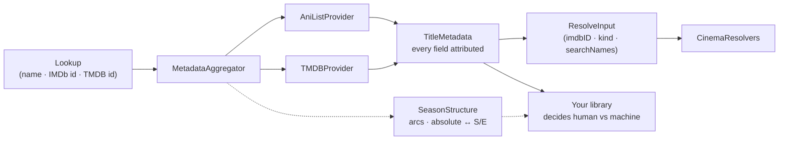

<div align="center">

# 🎞️ Slate

**What is this?**
A dependency-free Swift package that asks every metadata provider at once and answers with values that each say **where they came from**.

[](CHANGELOG.md)
[](https://swift.org)
[](#-platform-support)
[](https://swift.org/package-manager)
[](#-installation)
[](#-design-notes)
[](#-credentials)

</div>

---



## 🎬 The trio

Slate is one third of a set. The name is the clapperboard — the one object whose
whole job is to state what a piece of footage *is* before anyone can tell by
looking. A studio's *slate* is also its roster of titles.

| Package | Question it answers |
| :--- | :--- |
| **Slate** | *What is this?* |
| **CinemaResolvers** | *Where do I get it?* |
| **Cinema** | *Where do I watch it?* |

## ⚡ Quick start

```swift
let slate = MetadataAggregator(providers: [
    AniListProvider(),                     // no credential
    TMDBProvider(accessToken: token),      // injected, never stored
])

let result = await slate.metadata(for: Lookup(search: "Attack on Titan"))

result.title.best                  // "Shingeki no Kyojin"
result.title.bestProvider          // .aniList
result.overview.value(from: .tmdb) // TMDB's summary — still there
result.searchNames                 // romaji first, for the tracker
result.resolveInput                // hand straight to a resolver
```

## 🧭 The one rule: values carry their source

Every field of `TitleMetadata` is a `Field`, not a bare `String`:

| You ask | You get |
| :--- | :--- |
| `field.best` | The winning value |
| `field.bestProvider` | Who won it |
| `field.value(from:)` | What one specific provider said |
| `field.dissent` | What the losers said — reachable, never the default |
| `result.provenance` | `[FieldKey: Provider]` — the whole record at once |

This exists because of a specific bug. A library that stores merged values behind
a single *this record was edited* flag will, on a refresh from provider #4,
silently overwrite a correction to a field that provider #1 supplied — and it
reads as a sync bug for weeks. Provenance has to be **per field**, and it is far
cheaper to design in than to retrofit.

## ⚖️ Which decisions live where

> **Slate settles provider vs provider.**
> That AniList outranks TMDB for anime is a fact about AniList and TMDB, so no
> consumer should have to know it. That verdict is `field.best`.

> **Slate does not settle human vs machine.**
> Whether a hand-edit outranks a refresh is a fact about *your* schema and *your*
> user. `FieldKey` makes that policy a loop instead of a branch per field:

```swift
for (field, provider) in result.provenance {
    // "Did a human touch this field, and if not, is `provider` one I accept?"
    // Some fields stay machine-owned even on a hand-edited record — artwork,
    // ids, trailers — and that set is yours to declare, not Slate's.
}
```

Thirteen hand-written branches drift apart. A loop does not.

## 🔌 Providers

| Provider | Credential | Gives |
| :--- | :--- | :--- |
| **TMDB** | v4 read token | The IMDb id · western movies & TV · art · ratings |
| **AniList** | **none** | Anime detection · romaji & native names · episode counts |

**Two deliberate silences.** TMDB reports `isAnime` as `nil`, never `false` — it
has no anime type and its `anime` keyword is volunteer-applied, so AniList
answering *at all* is the signal; a guess dressed as a value is worse than an
absence. And AniList synonyms are filtered to mostly-Latin names: romaji, English
and native Japanese are always kept because trackers do file under the Japanese
title, but AniList carries the Thai, Hebrew and Arabic name of everything, and a
resolver that matches by substring gets nothing from those but false hits.

A provider that fails is **not** an error. It lands in `result.failures` and the
others still answer.

## 📺 Seasons and episodes

TV shows have seasons and episodes, and a provider that says *366 episodes, one
season* has not answered the question. TMDB files Bleach that way; Detective
Conan as one season of 1212. Nothing else in the world numbers them like that —
Wikipedia, TheTVDB and the groups that name the releases all count arcs.

```swift
let structure = await slate.seasons(for: result.ids)

structure?.ordering                       // .episodeGroup(name: "TVDB Order")
structure?.numberedSeasons.count          // 16, not 1
structure?.position(ofAbsolute: 340)      // "Bleach - 340" → S14E7
structure?.nativeRange(ofSeason: 2)       // (season: 1, episodes: 21...41)
```

The correction comes from TMDB itself, through `episode_groups` — which means
**TheTVDB's ordering without a TheTVDB key.**

It intervenes narrowly, and that is the whole safety argument. Only when TMDB is
clearly flattening (any season of 60+), only towards an ordering that accounts
for *every* episode the show is said to have, and only by name — `TVDB Order`
first, then an original-air-date ordering. Story-arc orderings are never a
fallback: Bleach carries three that split the same 366 episodes 21, 12 and 25
ways, and picking one arbitrarily silently renumbers somebody's library.

| Question | Answer |
| :--- | :--- |
| `position(ofAbsolute:)` | `Bleach - 340` → the season and episode it is shown under |
| `absolute(ofSeason:episode:)` | back the other way |
| `nativeRange(ofSeason:)` | the provider's own numbers for an arc — what an indexer can be asked |
| `position(ofNativeSeason:episode:)` | filing a file that was matched against TMDB |
| `absoluteNumbering` | `.stated` when the provider states the correspondence, `.derived` when it was walked |

Past the end of a run is left **unmapped, never clamped**. A number beyond the
last episode means the season list is incomplete or the show was matched wrongly,
and filing it somewhere plausible hides that instead of showing it.

> Ported from Cinema's `ShowSeasons`, `ArcSeasons` and `AbsoluteEpisodeMap`,
> whose thresholds were arrived at against real shows. Checked there: Suits, Rick
> and Morty, Attack on Titan, SPY × FAMILY and Frieren are untouched; Bleach,
> Detective Conan, One Piece and Naruto Shippūden are all caught.

## 🎯 Handing off

`result.resolveInput` is `(imdbID, kind, searchNames)` — the shape a resolver
wants, without Slate depending on one. It is `nil` unless some provider supplied
both an IMDb id and a kind, because a resolver cannot ask without them.

`searchNames` is **romaji first** on purpose: it is what a release group names a
file. The id is not always a bridge, and for Japanese titles that mapping often
does not exist at all — which is the whole reason AniList is in the first cut.

## 🔑 Credentials

Slate holds none, and this is a public repository — nothing in it is a key, and
nothing in it should become one.

```swift
let tmdb = TMDBProvider(accessToken: keychain.tmdbToken)  // sourced by you
await tmdb.updateAPIKey(rotatedToken)                     // rotated in place
```

Keys travel as `Authorization: Bearer`, **never** in a query string.

## 🚫 Deliberately not here

Each was considered on evidence and rejected. The reasoning is recorded so it
does not get re-argued — the full version lives in [CHANGELOG.md](CHANGELOG.md).

| Not shipped | Why |
| :--- | :--- |
| **AniDB** | Fansub-accurate episode numbering and specials — the one gap `TVDB Order` does not close. Still out because it is rate-limited and licence-encumbered, and an embedded client id in a public repo is a ban waiting to happen. This is the **most likely next provider**, not a permanent no. |
| **manami** | Bridges to neither IMDb nor TMDB. Tens of megabytes for ids nothing reads. |
| **Fribb / anime-lists** | *Does* carry the bridge, plus `episode_offset`. But 7.5 MB, and the mapping is many-to-one in the direction we would query — an IMDb id resolves to a **set**, so it still needs the disambiguation that name search does today. |
| **Watchmode** | Answers "where can I stream this" — the question this trio exists so nobody has to ask. |
| **Trakt scrobbling** | A different app's premise; its ratings duplicate MDBList's. |
| **TheTVDB** | Its episode ordering is the reason to want it — and TMDB's `TVDB Order` episode group already delivers that ordering, on the key we already have. Revisit only for a show where the group is missing or wrong. |
| **Fanart.tv · MDBList · OMDb** | Each is one more key and one more setup step. Add one when a field is missing that a user *notices*. |
| **Per-field priority** | Genuinely per-field domain knowledge — but with two providers the table is empty. When a third lands, `priority` becomes `[FieldKey: [Provider]]` and no caller changes. |

The bar for reopening any of these is the same: **name a title the current path
gets wrong.**

## 📦 Installation

```swift
.package(url: "https://github.com/Nico8324/Slate.git", from: "0.1.0")
```

```swift
.product(name: "Slate", package: "Slate")
```

## 💻 Platform support

| macOS | iOS | tvOS | visionOS |
| :---: | :---: | :---: | :---: |
| 26 | 26 | 26 | 26 |

## 🛠 Design notes

- **Swift 6 language mode, strict concurrency complete.** `Sendable` value types
  throughout; `TMDBProvider` is an `actor` because it holds a rotatable key.
- **No SwiftData, no UI, no `@MainActor` in the API surface.** Mapping these DTOs
  onto persistent models is the app's job and stays there.
- **No dependencies.** `Foundation` and `URLSession`, nothing else.
- **A provider may not rank itself, merge, or guess.** It answers with a
  `Snapshot` of flat optionals; the aggregator does the rest.
